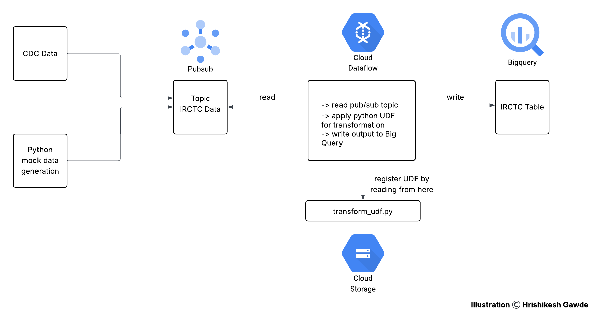

# IRCTC Streaming Data Ingestion into BigQuery

## Introduction
This project focuses on implementing a real-time streaming data ingestion pipeline into BigQuery using GCP native services and Python. The primary objective is to demonstrate real-time streaming ingestion, transformation using Python UDFs, and analytical storage into BigQuery. The data used for streaming is mock IRCTC booking data, resembling Change Data Capture (CDC) scenarios.

## Problem Statement
Traditional batch ETL pipelines often fall short when near real-time data availability is required for business reporting and analytics. This project addresses the need for a real-time data pipeline to ingest IRCTC booking data from a streaming source into BigQuery, with necessary data cleansing and transformation applied in-flight using Dataflow.

## Architecture
The architecture involves data publishing to a Pub/Sub topic, real-time data processing using Dataflow with a Python UDF for transformation, and ingestion into a target BigQuery table for downstream analytical consumption.

## Technology Used
- Python
- Google Cloud Pub/Sub
- Google Cloud Dataflow
- Google Cloud Storage
- BigQuery

## Dataset Used
We haven’t used any external dataset for this project. Instead, we are generating mock IRCTC booking data using a Python script and publishing it to the irctc-data Pub/Sub topic for downstream processing.

#### Input Data
- irctc-data Pub/Sub Topic: row_key, name, age, email, join_date, last_login, loyalty_points, account_balance, is_active, inserted_at, updated_at

#### Output Table
- BigQuery Table (irctc_dwh.irctc_stream_tb): row_key, name, age, email, join_date, last_login, loyalty_points, account_balance, is_active, inserted_at, updated_at, loyalty_status, account_age_days

## Scripts for Project
- irctc_mock_data_to_pubsub.py: Python script for generating mock IRCTC booking data and publishing it to the GCP Pub/Sub topic irctc-data.
- transform_udf.py: Python UDF file stored in GCS. Dataflow reads this file during pipeline execution to register the UDF. It applies data cleaning, enrichment, timestamp formatting, and business logic like loyalty status and account age calculation.
- bigquery_create_table.sql: SQL command to create BigQuery table.

## Output and Impact
- Transformed and cleaned streaming data from Pub/Sub is written to the BigQuery table irctc_dwh.irctc_stream_tb.
- Derived fields such as loyalty_status and account_age_days are calculated in-flight within the Dataflow pipeline.
- The pipeline ensures continuous and near real-time availability of IRCTC booking data in BigQuery for downstream analytics, reporting, or dashboarding.

## My Learnings
- Hands-on experience with GCP Pub/Sub for real-time message ingestion.
- Development and registration of Python UDFs for use within Dataflow streaming jobs.
- Setting up and managing a Dataflow streaming pipeline to consume from Pub/Sub and write to BigQuery.
- Practical understanding of streaming ETL design patterns on GCP.
- Data quality and enrichment handling within streaming pipelines.
